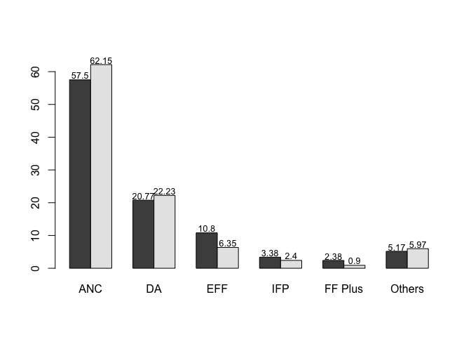
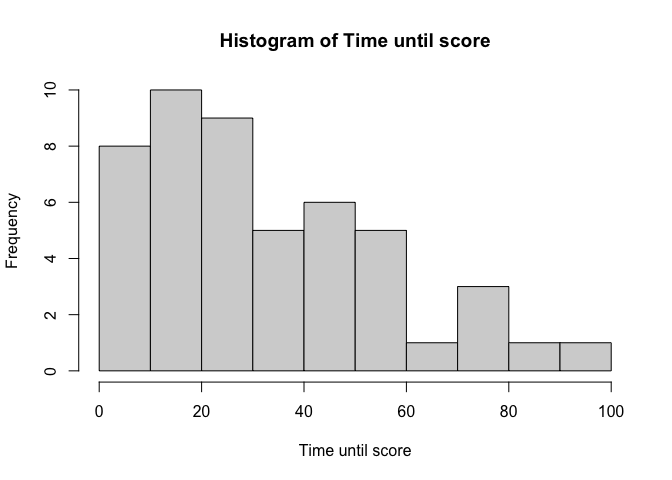
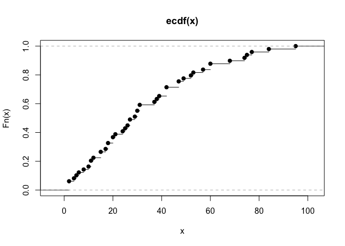
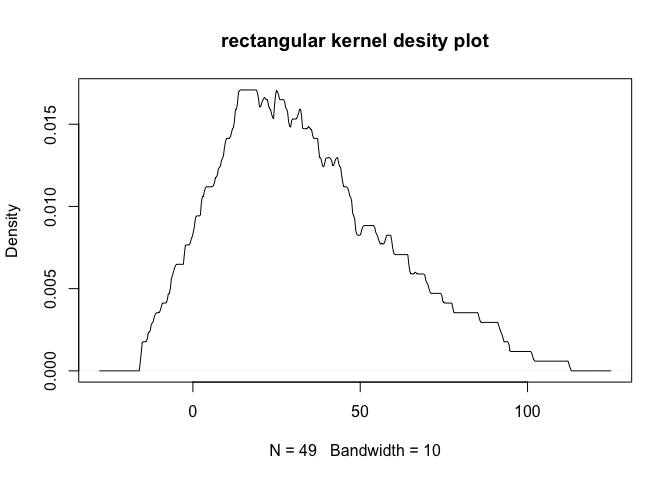
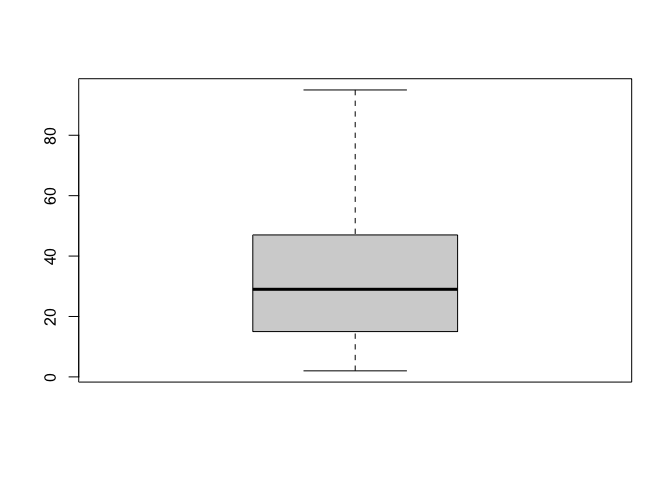
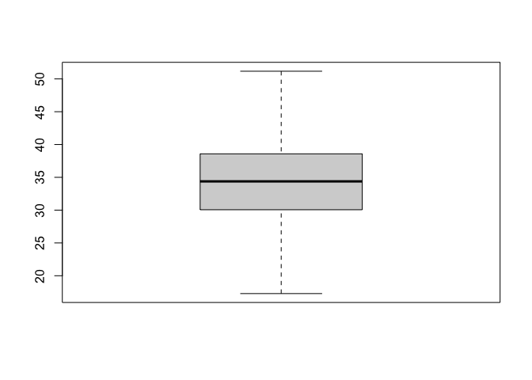
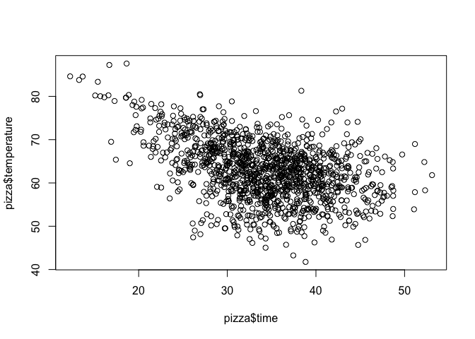

###### b06901048 電機五 陳昱行

Problem1
--------

### i.

``` r
col.name <- c('Party', 'Results 2019 (%)', 'Results 2014 (%)')
Party <- c('ANC', 'DA',
'EFF','IFP','FF Plus','Others')
Results_2019 <- c(57.50,20.77,10.80,3.38,2.38,5.17)
Results_2014 <- c(62.15,22.23,6.35,2.40,0.90,5.97)
dat <- data.frame(Party,Results_2019,Results_2014)
names(dat) <- col.name
library(knitr)
kable(dat[1:6,])
```

| Party   | Results 2019 (%) | Results 2014 (%) |
|:--------|-----------------:|-----------------:|
| ANC     |            57.50 |            62.15 |
| DA      |            20.77 |            22.23 |
| EFF     |            10.80 |             6.35 |
| IFP     |             3.38 |             2.40 |
| FF Plus |             2.38 |             0.90 |
| Others  |             5.17 |             5.97 |

``` r
summary(dat)
```

    ##     Party           Results 2019 (%) Results 2014 (%)
    ##  Length:6           Min.   : 2.380   Min.   : 0.900  
    ##  Class :character   1st Qu.: 3.828   1st Qu.: 3.292  
    ##  Mode  :character   Median : 7.985   Median : 6.160  
    ##                     Mean   :16.667   Mean   :16.667  
    ##                     3rd Qu.:18.277   3rd Qu.:18.260  
    ##                     Max.   :57.500   Max.   :62.150

### ii.

``` r
dat.plot <- matrix(c(Results_2019,Results_2014),nrow=2,ncol=6,byrow=T)
# quartz()
b <- barplot(dat.plot,names.arg=Party,beside=T,ylim=c(0,65))
text(x = b, y=dat.plot, label=dat.plot,pos = 3, cex = 0.8,offset=0.1)
```



Problem2
--------

### i.

``` r
time.until.score <- c(53,49,42,26,6,39,60,10,47,2,38,74,18,52,29,11,24,21,57,42,37,17,12,18, 77,25,30,2,84,20,47,15,31,11,27,95,68,42,20,15,75,27,8,31,5,4,60,30,2)
table(time.until.score)
```

    ## time.until.score
    ##  2  4  5  6  8 10 11 12 15 17 18 20 21 24 25 26 27 29 30 31 37 38 39 42 47 49 
    ##  3  1  1  1  1  1  2  1  2  1  2  2  1  1  1  1  2  1  2  2  1  1  1  3  2  1 
    ## 52 53 57 60 68 74 75 77 84 95 
    ##  1  1  1  2  1  1  1  1  1  1

``` r
F.head <- ecdf(time.until.score)
print(c(F.head(30),F.head(45),F.head(60)))
```

    ## [1] 0.5510204 0.7142857 0.8775510

### ii.

``` r
f.head <- density(time.until.score, kernel="rectangular",bw = 10)
# n is default to 512
print(c(f.head$y[30],f.head$y[45],f.head$y[60]))
```

    ## [1] 0.000000000 0.001767399 0.003534798

### iii.

``` r
mean(time.until.score)
```

    ## [1] 33.36735

``` r
median(time.until.score)
```

    ## [1] 29

``` r
quantile(time.until.score,c(0.75,0.25))
```

    ## 75% 25% 
    ##  47  15

### iv.

``` r
#interquantile range
quantiles <- quantile(time.until.score,c(0.75,0.25))
unname(quantiles[1] - quantiles[2])
```

    ## [1] 32

``` r
#variance
var(time.until.score)
```

    ## [1] 557.3206

### v.

``` r
hist(time.until.score,xlab="Time until score",main = paste("Histogram of" , "Time until score"))
```



``` r
plot.ecdf(time.until.score)
```



``` r
plot(f.head,main=paste("rectangular kernel desity plot"))
```



``` r
boxplot(time.until.score)
```



Problem 3
---------

### i.

``` r
pizza <- read.csv('http://chris.userweb.mwn.de/book/pizza_delivery.csv',
                  stringsAsFactors = T)
summary(pizza[c('time','temperature','bill','pizzas')])
```

    ##       time        temperature         bill           pizzas      
    ##  Min.   :12.27   Min.   :41.76   Min.   : 9.10   Min.   : 1.000  
    ##  1st Qu.:30.06   1st Qu.:58.24   1st Qu.:35.50   1st Qu.: 2.000  
    ##  Median :34.38   Median :62.93   Median :42.90   Median : 3.000  
    ##  Mean   :34.23   Mean   :62.86   Mean   :42.76   Mean   : 3.013  
    ##  3rd Qu.:38.58   3rd Qu.:67.23   3rd Qu.:50.50   3rd Qu.: 4.000  
    ##  Max.   :53.10   Max.   :87.58   Max.   :75.00   Max.   :11.000

### ii.

``` r
quantile(pizza$time,0.99)
```

    ##      99% 
    ## 48.61677

``` r
quantile(pizza$temperature,0.99)
```

    ##   99% 
    ## 79.87

### iii.

``` r
mean(abs(pizza$temperature - mean(pizza$temperature)))
```

    ## [1] 5.473862

``` r
mad(pizza$temperature,constant=1)
```

    ## [1] 4.494156

### iv.

``` r
mean(scale(pizza$time))
```

    ## [1] 5.222066e-16

``` r
# variance is a matrix
var(scale(pizza$time))[1]
```

    ## [1] 1

### v.

``` r
boxplot(pizza$time,range=0)
```



### vi.

``` r
plot(pizza$time,pizza$temperature)
```



``` r
cor(pizza$time,pizza$temperature, method = 'pearson')
```

    ## [1] -0.433935

``` r
cor(pizza$time,pizza$temperature, method = 'spearman')
```

    ## [1] -0.3912803

Problem4
--------

``` r
passenger.classes <- c('first','second','third','staff')
passenger <- c(337,285,721,885)
passenger.rescued <- c(135,160,541,674)
passenger.unrescued <- passenger - passenger.rescued
```

### i.

``` r
table.contigency <-matrix(c(passenger.rescued,passenger.unrescued),nrow=2,ncol=4,byrow=T)
dimnames(table.contigency) <- list(c('rescued','unrescued'),passenger.classes)
table.contigency.addmargin <- addmargins(table.contigency)
print(table.contigency.addmargin)
```

    ##           first second third staff  Sum
    ## rescued     135    160   541   674 1510
    ## unrescued   202    125   180   211  718
    ## Sum         337    285   721   885 2228

### ii.

``` r
expected.absolute.frequency <- NULL
n <- table.contigency.addmargin['Sum','Sum']
for(i in table.contigency.addmargin['Sum',]){
    expected.absolute.frequency <- c(expected.absolute.frequency,i*table.contigency.addmargin['rescued','Sum']/n)
}
print(expected.absolute.frequency)
```

    ## [1]  228.3977  193.1553  488.6490  599.7980 1510.0000

### iii.

``` r
min.k.l <- min(dim(table.contigency))
chi <- chisq.test(table.contigency)$statistic
Cramers.V <-sqrt(chi/(table.contigency.addmargin['Sum','Sum']*(min.k.l-1)))
print(paste("χ2 = ",chi,"Cramer's V = ",Cramers.V))
```

    ## [1] "χ2 =  182.063173691428 Cramer's V =  0.28586004730962"

### iv.

``` r
concordant.K <- 0
decordant.D <- 0
rev.table.contigency <- matrix(rev(table.contigency),nrow=2,ncol=4)
print(rev.table.contigency)
```

    ##      [,1] [,2] [,3] [,4]
    ## [1,]  211  180  125  202
    ## [2,]  674  541  160  135

``` r
#calculate concordant
for( i in seq(1,dim(rev.table.contigency)[2]-1)){
    for(j in seq(i+1,dim(rev.table.contigency)[2])){
        concordant.K <- concordant.K + rev.table.contigency[1,i] * rev.table.contigency[2,j]
    }
}
#calculate decordant
for( i in seq(dim(rev.table.contigency)[2],2)){
    for(j in seq(i-1,1)){
        decordant.D <- decordant.D + rev.table.contigency[1,i] * rev.table.contigency[2,j]
    }
}
n <- table.contigency.addmargin['Sum','Sum']
print(paste("γ = ",(concordant.K-decordant.D)/(concordant.K+decordant.D),"τc = ",2*min(dim(rev.table.contigency))*(concordant.K-decordant.D)/(n^2*min.k.l-1)))
```

    ## [1] "γ =  -0.381999107003998 τc =  -0.122713542460405"

### v.

``` r
new.class <- c('Class A','Class B')
new.rescued <- c(135+160,541+674)
new.total <- c(337+285,721+885)
new.unrescued <- new.total - new.rescued
new.contingency.table <- matrix(c(new.rescued,new.unrescued),nrow=2,ncol=2)
dimnames(new.contingency.table) <- list(c('rescued','unrecued'),new.class)
new.contingency.table.addmargin <- addmargins(new.contingency.table)
print(new.contingency.table.addmargin)
```

    ##          Class A Class B  Sum
    ## rescued      295     327  622
    ## unrecued    1215     391 1606
    ## Sum         1510     718 2228

``` r
new.chi <- chisq.test(new.contingency.table)$statistic
new.min.k.l <- min(dim(new.contingency.table))
new.Cramers.V <- sqrt(new.chi/(new.contingency.table.addmargin['Sum','Sum']*(new.min.k.l-1)))
print(paste("χ2 = ",new.chi,"Cramer's V = ",new.Cramers.V))
```

    ## [1] "χ2 =  162.261077205382 Cramer's V =  0.269866877553103"

``` r
risk.new.unrescued.classB <-new.contingency.table.addmargin[2,2]/new.contingency.table.addmargin[2,3]
risk.new.unrescued.classA <-new.contingency.table.addmargin[1,2]/new.contingency.table.addmargin[1,3]
relative.risk <- risk.new.unrescued.classB/risk.new.unrescued.classA
relative.not.risk <- (1-risk.new.unrescued.classB)/(1-risk.new.unrescued.classA)
print(paste("relative risks = ",relative.risk, "odds ratio = ",relative.risk/relative.not.risk))
```

    ## [1] "relative risks =  0.463099005640164 odds ratio =  0.290318521035477"
