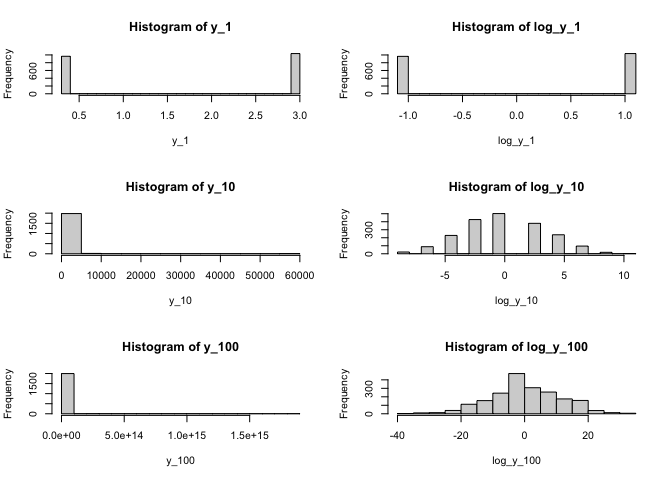
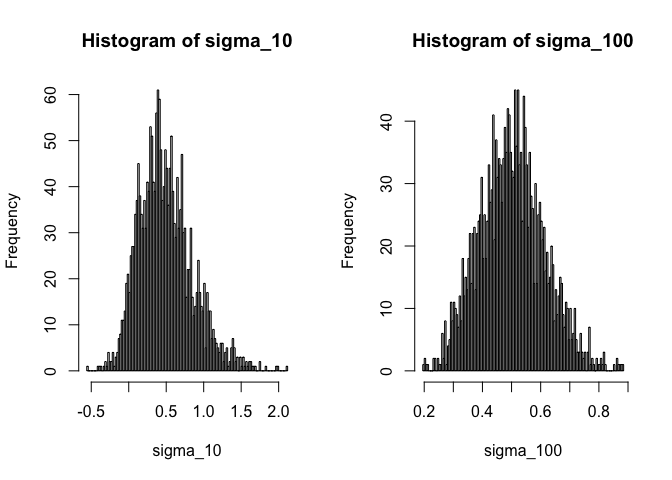

Problem 4
---------

### c.

``` r
par(mfcol=c(3,2))
y_n <- function(n){
    # do n trials(Xn) with fliping only once and count success time (0 or 1)
    return(replicate(2000,prod(8/3*rbinom(n,1,0.5)+1/3), simplify = "array"))
}
log_y_n <- function(n){
    return(replicate(2000,sum(log(8/3*rbinom(n,1,0.5)+1/3)), simplify = "array"))
}
y_1 <- y_n(1)
y_10 <- y_n(10)
y_100 <- y_n(100)
log_y_1 <- log_y_n(1)
log_y_10 <- log_y_n(10)
log_y_100 <- log_y_n(100)
hist(y_1,breaks = 20)
hist(y_10,breaks= 20)
hist(y_100,breaks= 20)
hist(log_y_1,breaks = 20)
hist(log_y_10,breaks = 20)
hist(log_y_100,breaks = 20)
```



Problem 5
---------

### c.

``` r
library("MASS")
cov_mat  <- matrix(c(1,0.5,0.5,1),2,2)
mu <- c(0,0)
sigma_n <- function(n){
    #cov return a covariance matrix
    return(replicate(2000,cov(mvrnorm(n,mu,cov_mat))[1,2],simplify = "array"))
}
sigma_10 <- sigma_n(10)
sigma_100 <- sigma_n(100)
par(mfrow=c(1,2))
hist(sigma_10,breaks=100)
hist(sigma_100,breaks=100)
```


